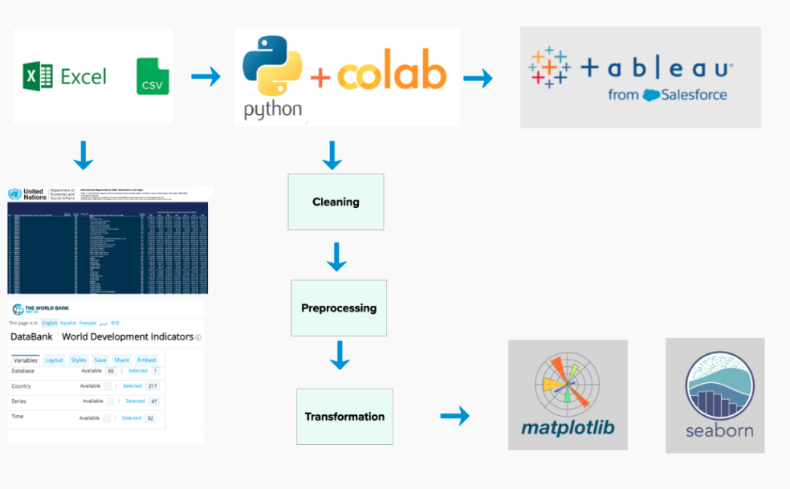

# Data Visualization Class Project

 Individual contribution for data visualization final project: 
 
 - Data preprocessing and transformation
 - Visualizations in Python and Tableau

## Project Objective
The U.S. has more immigrants than any other country in the world - and this inspired our group to look into what causes people to migrate around the world. We looked into factors that included: GDP, education, life expectancy, crime rates, climate change, and so forth to get a better picture of why people move. We hope to bring more transparency to the topic of migration.

## Datasets

### Dataset 1: UN migrant stock data 
 - Table 1: International migrant stock at mid-year by sex and by region, country or area of destination and origin, 1990-2020. The estimates are based on official statistics on the foreign-born or the foreign population. This dataset is an Excel file of aggregated statistics. We extracted the country of origin, destination country, and migrant stock for 1990-2020. Refer to our Colab notebook to read our ETL. Source: https://www.un.org/development/desa/pd/content/international-migration-1 
 
### Dataset 2: World development indicators
World Development Indicators (WDI) is the primary World Bank collection of development indicators, compiled from officially recognized international sources. It presents the most current and accurate global development data available, and includes national, regional and global estimates. 
For our presentation, we extracted 47 indicators, 217 countries, and 32 years (1990 - 2021). Then combined this data with the the migrant stock data to create a master dataset to use in Tableau.
Source: https://databank.worldbank.org/source/world-development-indicators

## ETL 

## Visualizations in Python

## Visualizations in Tableau

 

