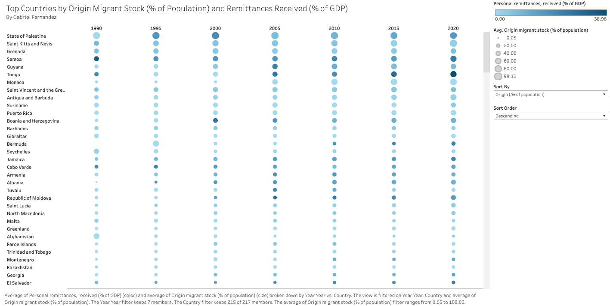

## Data visualization class project
By Gabriel Fernandez  
Fall 2022

### Project bites

**Brief**: Our project centers on comprehending the drivers of global migration, with a specific emphasis on World Development Indicators (WDI). Our objective was to unearth insights and convey them through impactful visualizations.

**Key insights**: Notable findings include a reciprocal migrant flow between Mexico and the USA, the USA remaining a primary destination, and the role of violent conflict in driving migration.

**Tools**: Colab, Python, Tableau 

**Concepts**: ETL (Extract, Transform, Load) and charts (Sankey, Slope, Heatmap, Line, and Scatterplot)

### Project objective

The United States has more immigrants than any other country, which inspired our group to look into what causes people to migrate across the globe. We looked into factors that included GDP, education, life expectancy, crime rates, climate change, and so forth to understand better why people move. We hope to bring more transparency to the topic of migration. 

#### Individual contribution to our data visualization final project:

- **Data Preparation and Transformation (ETL)**: I worked on getting our data ready for analysis, involving the extraction, cleaning, transformation, and merging of datasets.

- **Creating Visualizations**: Using Python and Tableau, I crafted charts that helped me better understand the data and discover valuable insights.

#### Selected indicators

In our project, I concentrated on two particular indicators to analyze their relationship with migration patterns:

**Internally displaced persons (number of people displaced by conflict and violence)**: This indicator helped me understand the impact of conflict and violence on migration.

**Personal remittances received (% of GDP)**: I selected this indicator to explore the link between remittances and origin countries.

#### Rationale for my visualization choices

I chose these visualizations for our project because they are effective in conveying essential information about migrant stock and world indicators:

- **Sankey chart**: Shows migration flow from origin to destination countries.
- **Slope chart**: Highlights changes between two specific points in time.
- **Heatmap**: Displays relationships involving multiple variables.
- **Line chart**: Depicts general migrant patterns.
- **Scatterplot**: Examines the connection between two variables.

In addition, I ensured that my visualization titles conveyed the main points, making it easy to understand the key findings.

### Datasets

#### Dataset 1: UN migrant stock data 

 Table 1: International migrant stock at mid-year by sex and by region, country or area of destination and origin, 1990-2020. The estimates are based on official statistics on the foreign-born or foreign population. This dataset is an Excel file of aggregated statistics. We extracted the country of origin, destination country, and migrant stock for 1990-2020. Source: https://www.un.org/development/desa/pd/content/international-migration-1 
 
#### Dataset 2: World development indicators

World Development Indicators (WDI) is the primary World Bank collection of development indicators, compiled from officially recognized international sources. It presents the most current and accurate global development data available and includes national, regional, and global estimates. 
For our presentation, we extracted 47 indicators, 217 countries, and 32 years (1990 - 2021). Then, I combined this data with the migrant stock data to create a master dataset to use in Tableau. Source: https://databank.worldbank.org/source/world-development-indicators

### ETL (Extract, Transform, Load)
For a closer look at our ETL (Extract, Transform, Load) process, you can refer to the Python code available in our Colab notebook: [notebook_documented_ETL](https://colab.research.google.com/drive/1FWbX_sL6De_XxCjx1aOhbMhN-uh7Gp8h?usp=sharing)

### Visualizations in Python

#### Sankey charts

#### Slope charts

 

### Visualizations in Tableau

#### Heatmap

#### Line chart

#### Scatterplot

### Key insights

- Reciprocal Migrant Flow: Mexico is the primary source of US migrants (9.5 average from 1990 to 2020), while the USA significantly contributes to Mexican migration (0.5 million), illustrating a reciprocal dynamic.
  
- Migration Trends: In 2020, the USA continued as the primary destination for migrants since the 90s, while India overtook Russia as the leading migrant source, signifying a significant shift.
  
- Conflict Fuels Migration: War and internal conflict, such as in Syria and Iraq, fuel migrant outflows.

### Lessons learned

- Cross-country migration is a complex and ever-changing phenomenon impacting numerous countries globally. UN estimates, though valuable, may not encompass the complete data due to challenges in data collection, especially when new countries emerge, as seen after the fall of the Soviet Union.

- Given events like the COVID-19 pandemic and emerging conflicts, UN data, reported every five years, may not consistently depict current conditions. I look forward to examining the 2025 data to understand how the pandemic may have influenced global migration patterns.
  
- Tackling the UN's aggregated Excel tables can feel like solving a tricky puzzle. Working to transform them into a more user-friendly long format has been quite the learning adventure.

 

