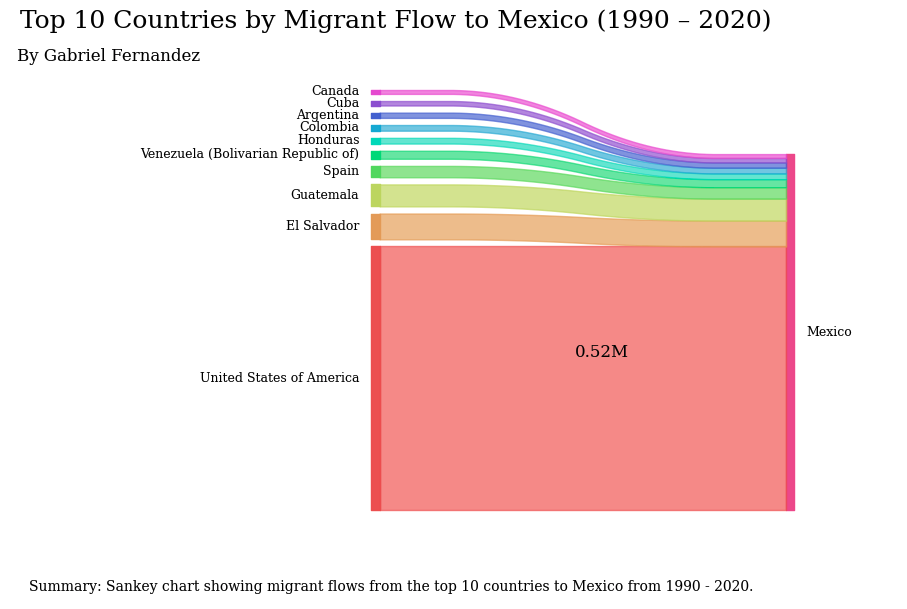

# Data Visualization Class Project
By Gabriel Fernandez

## Project Objective
The U.S. has more immigrants than any other country in the world - and this inspired our group to look into what causes people to migrate around the world. We looked into factors that included: GDP, education, life expectancy, crime rates, climate change, and so forth to get a better picture of why people move. We hope to bring more transparency to the topic of migration. 

 Individual contribution to data visualization final project: 

- **Data Preparation and Transformation (ETL)**: I worked on getting our data in shape for analysis. This involved cleaning and organizing the data so that it made sense. I also created new variables to make the data more useful for our analysis.

- **Creating Visualizations**: I used Python and Tableau to make various charts helped us understand the data better and share our findings.

I selected two specific indicators to focus on:

**Internally Displaced Persons (Number of People Displaced by Conflict and Violence)**: This indicator helped me understand the impact of conflict and violence on migration.

**Personal Remittances Received (% of GDP)**: I selected "Personal Remittances Received (% of GDP)" to explore the link between remittances and origin countries.

In addition,I ensured that my visualization titles clearly conveyed the main points, making it easy to understand the key findings.

## Datasets

### Dataset 1: UN migrant stock data 

 Table 1: International migrant stock at mid-year by sex and by region, country or area of destination and origin, 1990-2020. The estimates are based on official statistics on the foreign-born or foreign population. This dataset is an Excel file of aggregated statistics. We extracted the country of origin, destination country, and migrant stock for 1990-2020. Source: https://www.un.org/development/desa/pd/content/international-migration-1 
 
### Dataset 2: World development indicators

World Development Indicators (WDI) is the primary World Bank collection of development indicators, compiled from officially recognized international sources. It presents the most current and accurate global development data available and includes national, regional, and global estimates. 
For our presentation, we extracted 47 indicators, 217 countries, and 32 years (1990 - 2021). Then, I combined this data with the migrant stock data to create a master dataset to use in Tableau. Source: https://databank.worldbank.org/source/world-development-indicators

## ETL 
For a closer look at our ETL (Extract, Transform, Load) process, you can refer to the Python code available in our Colab notebook: [notebook_documented_ETL](https://colab.research.google.com/drive/1FWbX_sL6De_XxCjx1aOhbMhN-uh7Gp8h?usp=sharing)

## Visualizations in Python

## Visualizations in Tableau

 

